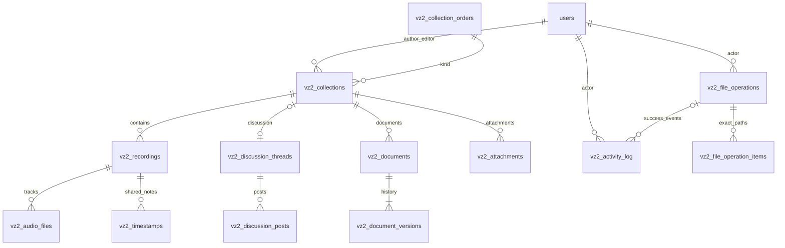

# Virtuální zkušebna 2.0 – návrh první etapy

Stav: **návrh ke kontrole, bez změny runtime a bez aplikace SQL**, 16. 9. 2026.
Podklady: [inventura](inventory.md), [SQL návrh](schema-draft.sql),
[ověření a budoucí scénáře](verification.md).

## 1. Rozsah, původ rozhodnutí a Git

**Závazné zadání:** PHP + MariaDB bez frameworku pro jednu kapelu, nové tabulky
`vz2_`, osobní účty a login zachovat, starý obsah ani testovací multitracky
nemigrovat. Nyní pouze návrh. Bez commitu, push, merge, nasazení, runtime změn,
DDL v provozní DB nebo mazání. Audio na disku; katalog a zápisy výhradně SQL.
Vlastník a autor z ověřené session, admin nemění původní autorství. Hostovi
nepřidávat práva. Žádné playlisty ani automatický import FTP obsahu.

**Ověřený checkout:** `E:/_PROGRAMING/virtualnizkusebna_beta`, remote origin
`https://github.com/TheVecala/virtualnizkusebna`, větev `feature/zkusebna2.0`,
výchozí HEAD `cd26bd8b011e94f9da34a685653c8e0333e104f2`, čistý pracovní strom.
Po úspěšném `git fetch origin` existuje vzdálená feature větev na stejném HEAD
(ahead/behind 0/0). Poznámka v zadání o dříve chybějící vzdálené větvi už tedy
neodpovídá nynějšímu stavu. Fetch potřeboval povolení zápisu Git metadat mimo
sandbox. Nebyl nalezen platný AGENTS.md v checkoutu ani nadřazených adresářích.

**Technický návrh:** následující model a algoritmy jsou doporučené provedení
závazného zadání. Ověřená zjištění mají odkazy v inventuře. Neověřené hostingové
údaje jsou výslovně oddělené v kapitole 9; nejsou důvodem odhadovat živé schema.

## 2. ER model a slovník

Každé další `created_by`, `updated_by`, `deleted_by` a autor verze odkazuje
na users.id (v diagramu neopakováno). Vlákno Nápady nemá kolekci; ostatní mají
právě jednu. Zpětný složený FK z dokumentu na aktuální verzi zajišťuje, že obsah
patří témuž dokumentu. Deník ani technické snapshoty operací nemají FK na cíl,
proto přežijí jeho smazání. Toto omezené použití typu+ID není univerzální model
obsahu: všechny obsahové vazby jsou konkrétní FK.

SQL je normativní pro typy, NULL, defaulty, klíče a indexy. Všechny tabulky
InnoDB/utf8mb4_unicode_ci. Obsahová ID `INT UNSIGNED AUTO_INCREMENT` (rozsah do
4 294 967 295) vyhovují jedné kapele i přesnému JS Number; users má stejný typ
doložený migrací. UUID pro obsah nejsou potřeba. Deník má BIGINT ID, API je vrací
jako desetinný řetězec. Request klíč operace je 16 náhodných bajtů v hexu, nejde
o identitu obsahu. ID se nevracejí do oběhu, žádný TRUNCATE ani reset čítačů.

| Tabulka | Význam a další pravidla aplikace |
|---|---|
| `vz2_collection_orders` | Dva pevné řádky song/rehearsal, revize společného pořadí. Vložené SQL návrhem, bez fiktivního autora. |
| `vz2_collections` | Skladba/zkouška, title 1–200 znaků, slug max. 80 ASCII znaků zachycený při založení, sort_order, metadata revision a recordings_revision. Bez audia a diskové složky je plnohodnotná. Druh se běžnou editací nemění. |
| `vz2_recordings` | Povinná kolekce, explicitní single/multitrack, title, neměnný storage_dir, summary a vlastní autorství souhrnu, duration_ms, pořadí, revize metadat a celého seznamu timestampů. Kind se počtem dostupných souborů nemění. |
| `vz2_audio_files` | Jeden řádek za stopu; title, původní název, relativní cesta, MIME/format/velikost/hash/délka, pořadí, stav a autor uploadu. I odstraněné stopy se uchovají. Vlastnictví pro změny stop se řídí vlastníkem nahrávky. |
| `vz2_timestamps` | Recording FK, song_start/passage/note, time_ms, text, vlastní autor/editor a row revision. Konec úseku se neukládá. |
| `vz2_discussion_threads` | Unikátní collection_id nebo jediný global_key=ideas, XOR hlídá CHECK. Žádná vazba na nahrávku. Vlákno nemá obsah ani autora. |
| `vz2_discussion_posts` | Stabilní post.id, body, autor/editor, revize, UTC časy. Čas nikdy není identifikátor. |
| `vz2_documents` | Nejvýše jeden lyrics_chords a jedna tablature na kolekci. Původní autor, poslední editor, title a ukazatel current_revision. |
| `vz2_document_versions` | Neměnný obsah MEDIUMTEXT + autor a čas každé verze; PK document_id/revision. Aktuální obsah se čte JOINem, neduplikuje se. |
| `vz2_attachments` | Zachování nynějších PDF/TXT/obrázků jako příloh kolekce, odděleně od audia. Vlastní popisek summary se stejným autorstvím jako u nahrávky, bezpečnost uploadu a revize; nejsou textový editor ani historie dokumentu. |
| `vz2_file_operations`, `…_items` | Malý trvalý seznam nedokončených souborových operací, konkrétní cesty a hash, idempotence a opakování po pádu; ne druhý katalog ani deník úspěchů. |
| `vz2_activity_log` | Jen úspěšné důležité změny, aktér + jméno v době změny, UTC čas, prostředí, typ/ID/název cíle, případně snapshot kolekce a krátký detail. |

Povinné časy a autory bez DEFAULT dodává server, ne formulář. Při vytvoření
updated_by/updated_at odpovídají created_by/created_at. Při editaci se mění jen
updated_* a revize. U souhrnu vzniká summary_created_* prvním uložením neprázdného
obsahu; pozdější vyprázdnění zachová prvního autora a nastaví nový editor/čas.
Title nahrávky se řídí autorem nahrávky, souhrn také, nikoli autorem timestampu.
Deaktivované users zůstávají referencovatelné a v UI označené neaktivní.

Veškeré VZ2 DATETIME jsou UTC, PHP používá explicitní UTC a SQL spojení
`SET time_zone = '+00:00'`; UI převádí do Europe/Prague. Čas v API ISO 8601 s Z.
Žádné implicitní ON UPDATE pro revize a autorství. Staré users časy se v této
etapě nepřepisují; VZ2 deník časuje nezávisle jednotně. Sekundy stačí pro audit,
pořadí událostí doplňuje ID, nikoli čas jako unikátní hodnota.

Délky a timestampy jsou celá **ms**, přijímaný rozsah 0 až 604 800 000 (7 dní,
navazuje na současný limit multitrackového zápisu). Délka NULL znamená nezjištěno,
nikoli nula. Délku single určuje jediný soubor, multitrack nejdelší stopa. Při
uploadu ji zjistit ze serverově ověřených metadat; dostupnost dekodéru je hostingová
podmínka. Pokud ji při novém uploadu nelze určit, ponechat upload nedokončený
s NULL délkou a konkrétní chybou; nezveřejnit ho jako active. Dokončení uploadu
vyžaduje známou délku každé stopy i celku. Nevydávat klientskou peaks duration
bez ověření za důvěryhodná metadata. Odebrání fyzicky dostupného audia s chybějící
délkou nejprve vyžaduje její doplnění. Pokud soubor neočekávaně zmizel ještě před
zjištěním délky, nelze ji vymyslet: ponechat NULL a tento stav přiznat. Při neznámé
délce poslední interval nemá známý konec a nelze ho loopovat. Známá délka se při
odstranění nikdy nemaže.

CHECK hlídá místní podmínky. Transakční služba musí navíc hlídat počet stop
(single právě 1, multitrack alespoň 1 při dokončení uploadu), dostupnost rodiče,
time_ms <= známé duration_ms, validní neprázdné texty (timestamp 4 000 znaků,
summary 10 000, příspěvek 20 000, dokument max. 1 MiB UTF-8), bezpečné cesty,
obsah MIME a hex hashe. Tyto podmínky SQL FK samotné nezajistí. Tituly nemusí být
unikátní. Pořadí nemá UNIQUE: shody stabilně rozhoduje ID, transakce uloží 0..N−1.

## 3. Práva, identita a souběh

Nový `php/inc/vz2_bootstrap.php`: session_start, config, auth_refresh_session,
pak kontrola logged_in_single/role; pro zápis povinný kladný users.id a aktivní
účet. Host může pouze číst již dovolený obsah. Nikdy fallback `SESSION[id]`,
`SESSION[jmeno]`, `POST[name]`, `POST[user_id]` nebo automatická role muzikanta.
Přístupová chyba při obnově identity je fail-closed. AJAX odpoví JSON a HTTP
401/403, nikoli login HTML s 200. Formulářový návrat používá ověřenou lokální
cestu a vlastní SITE_URL prostředí. Po loginu znovu validovat uložený deep-link.

| Akce | Člen | Admin |
|---|---|---|
| Nová kolekce | create_val | ano |
| Titul kolekce | rename_val + její created_by | vše |
| Upload nové nahrávky i do cizí kolekce | upload, cílová kolekce aktivní | vše |
| Název/popisek nahrávky, názvy stop | edit_recording_label + recording.created_by | vše |
| Přesun nahrávky/přílohy | move_file + vlastník přesouvaného objektu; cílový celek nemusí vlastnit | vše |
| Odebrání audia | delete_file + recording.created_by | vše |
| Přidat timestamp/příspěvek | comment; nezávisle na autorovi rodiče | vše |
| Editovat/smazat timestamp/příspěvek | comment + vlastní created_by | vše |
| Uložit text/tabulaturu včetně obnovení starší verze | edit_text, libovolný dokument | vše |
| Změna sdíleného pořadí kolekcí/nahrávek | reorder, bez požadavku vlastnit všechny řádky | vše |
| Pořadí stop uvnitř nahrávky | reorder + vlastník nahrávky | vše |
| Úplně smazat kolekci/nahrávku | nikdy | admin + potvrzení + očekávaná revize |
| Příloha: upload/popisek/odebrání souboru | upload / edit_recording_label+vlastník / delete_file+vlastník | vše |

Adminské „vše“ je explicitní serverová větev po ověření admina, nikoli důvěra v UI.
Přesun vyžaduje ověření zdrojové i cílové kolekce a konzistence recording ID; nesmí
převzít autorství. Vlastnictví kolekce nedává práva k cizím potomkům. Sdílené pořadí
je samostatná operace měnící jen sort_order a revizi scope, nikoli titul či autora
libovolného řádku. Odstranění posledního audia nikdy nemaže rodiče.

Všechny zapisující požadavky POST + CSRF (`auth_csrf_token`/`auth_check_csrf`),
včetně uploadu, peaks a výběru v session. Autorizovaná čtení žádné DDL. SQL
prepared statements, druh operace/tabulky jen serverový allowlist; HTML escape
a URL pouze http(s) u renderovaných odkazů. Uživatel nesmí dodat cestu na disk.
Přímé URL audia VZ2 vede přes endpoint `file_id`, login a Range streaming;
nikoli přes veřejný adresář s PHP spustitelným uploadem.

Každá editace přináší expected_revision. Služba uvnitř transakce znovu načte
řádek a vlastníka, zamkne rodiče potřebné pro souběh a provede CAS
`UPDATE … SET revision=revision+1 … WHERE id=? AND revision=?`. Nula ovlivněných
řádků => 409 (při smazaném objektu 404); klient zachová rozepsaný text a nabídne
načtení aktuální verze, nepřepisuje automaticky. Stejně chránit delete.
Před zápisem navíc znovu ověřit aktuální účet/roli; změny účtů používají existující
zámek auth_settings. Pro konzistentní autorizaci mohou krátké VZ2 transakce
zamknout auth_settings, ověřit aktéra, následně obsah. Neprovádět diskovou práci
pod tímto globálním zámkem. Rozpracovaná autorizovaná souborová operace už má
uloženého aktéra; její dokončení je dokončení úmyslu, ne nové oprávnění.

Zámky v jednotném pořadí: auth_settings, sekční order řádky, kolekce vzestupně
ID, nahrávky, dokument/objekt. Změny pořadí kolekcí i create/delete zvýší revision
sekce; insert/delete/move nahrávky i reorder zvýší recordings_revision všech
dotčených kolekcí. Přijmout právě aktuální množinu ID daného scope bez duplicit.
Řazení stop mění revision nahrávky. Vzájemně vyloučit pending file operace nad
týmž recording/attachment zámkem rodiče a kontrolou operací; file worker a
retry navíc drží jeden OS zámek `.locks/<operation-id>.lock` po celý postup.

## 4. Timestampy, dokumenty a diskuse

`php/inc/vz2_timestamps.php` poskytne společné list/create/update/delete pro oba
přehrávače. List vrátí recording_id, timestamps_revision, duration_ms a položky
v ms/id pořadí včetně created_by, updated_by, revize a can_edit/can_delete.
Změny zamknou nahrávku, ověří její timestamps_revision i revizi měněné položky,
provedou zápis + zvýšení timestamps_revision + log v jedné transakci. Přidání
položky také kontroluje revizi seznamu, takže zastaralý klient dostane 409.
Souhrn mění recording.revision, nikoli timestamps_revision; nepřepisuje pole
timestamps celým snapshotem a nehrozí ztráta cizího zápisu.

`js/vz2-timestamps.js` vyjme panel a ovládání ze současného looperu, zachová
typy, vložení s návratem na čas, editaci, smazání, kopírování a export. Malý
adaptér přehrávače: `seek(ms)`, `currentTimeMs()`, `durationMs()`,
`playRange(startMs,endMs)`, `canPlay()`. WebAudio/HTML audio převádějí na sekundy
jen na hranici. Mixér nemá druhý seznam ani druhý zapisující endpoint.

Začátek skladby končí nejbližším **striktně pozdějším** začátkem skladby;
pasáž nejbližší pozdější pasáží nebo začátkem skladby; jinak koncem nahrávky.
Poznámka interval neuzavírá. Body na stejném ms jsou dovolené a řadí se podle
ID, neukončují navzájem interval. Pro záznam bez audia funguje seznam, editace,
export, ale seek/loop/play jsou neaktivní. Neočekávaně chybějící část stop Mixéru
se ukáže jako neúplná sada, dostupné stopy lze přehrát s jasným stavem.

Dokument se zakládá až při prvním save: v jedné transakci insert dokument
s NULL current_revision, insert verze 1, update ukazatele na 1 a deník; commit
nikdy nesmí ponechat NULL u živého dokumentu. Nové uložení zamkne dokument,
porovná current_revision klienta, vloží N+1 s novým obsahem, nastaví ukazatel
a updated_*, zapíše deník a commitne. Původní autor dokumentu zůstává. Verze
jsou append-only; při obnově starší verze vzniká NOVÁ revize s obsahem staré.
Žádná automatická retence. UI historie nabídne stránkovaný seznam všech verzí
s autorem/časem a čtení konkrétního obsahu, bez povinného diff editoru.

Diskuse má jedno vlákno pro každou kolekci a jedny Nápady. Příspěvek nese
stabilní ID, ne čas. Každý požadavek explicitně identifikuje thread_id a při
změně post_id; server porovná skutečnou vazbu. Session výběru nikdy nerozhoduje
o cíli opožděného zápisu. Příspěvky přímo u nahrávek VZ2 nevytváří. Panel Mixéru
může otevřít diskusi jeho kolekce; staré `mt_diskuse_*` se nepřevádějí.

## 5. Disk, upload a částečné selhání

Navržený konfigurační blok: `VZ2_STORAGE_ROOT` (absolutní kanonická cesta),
`VZ2_ENVIRONMENT=beta|alpha`, `VZ2_DATASET_KEY` (stálý identifikátor konkrétní
VZ2 databázové sady) a `VZ2_WRITES_ENABLED`. Produkční hodnoty až po ověření
hostingu, nepřebírat z tohoto dokumentu jako skutečné. Jediný aktivní zapisující
web během přechodu; `.vz2-storage-id` u kořene obsahuje dataset key. Je to ochranná
značka úložiště, nikoli JSON katalog obsahu. Chybějící/neshodná značka => žádné
uploady ani mazání, ne automatické vytvoření prázdného kořene a závěr „audio chybí“.

Preferovaný nový oddělený kořen mimo veřejný web a mimo všechny staré uploady,
např. hostingem určený `/…/vz2-media/`. Lokální návrhový ekvivalent je
`<checkout>/var/vz2-media/` s explicitně zakázaným HTTP přístupem, ne používaný
adresář. Není tvrzením, že tyto cesty existují.

Pravidla cest:

* `skladby/<collection-id>-<slug>/r<recording-id>-<slug>/a<file-id>-<slug>.<ext>`;
  pro zkoušky `zkousky/…`, pro přílohy `…/prilohy/p<attachment-id>-<slug>.<ext>`.
* Slug jednou ze vstupního názvu: transliterace do malých ASCII a-z0-9, oddělovač
  `-`, ořez na 80/60/60 znaků pro celek/nahrávku/soubor, fallback `polozka`.
  Žádné tečky, lomítka, zpětná lomítka či uživatelské komponenty cesty. Číselné
  prefixy zamezí kolizím stejných názvů. Max. cesta 512 ASCII znaků.
* Název v UI a original_name zůstává Unicode. Přejmenování mění jen title.
  Slug kolekce je zachycen při založení, storage_dir nahrávky při uploadu;
  konečný relativní řetězec se uloží v SQL. Reservace ID se provede v krátké
  transakci, dočasný storage_dir `pending/<request_key>` se před commitem
  nahrazuje cestou s přiděleným ID. Pro file ID totéž s unikátní pending cestou.
* Fyzické soubory nikdy nepřepisovat; existující cílová cesta je konflikt 409,
  leda ověřené opakování téže operace se shodným file ID, velikostí a hashem.
* Přesun mění collection_id a SQL pořadí ve společné transakci. ID, storage_dir,
  file paths i autorství zůstávají. FTP cesta tak ukazuje původní umístění;
  záměrná cena jednoduchosti. Přesunutý obsah se při smazání původního celku
  nemaže: mazat výhradně soubory patřící aktuálním SQL potomkům, nikdy rekurzivně
  „složku skladby“. Prázdné adresáře uklidit jen přes ověřené rmdir.

Všechny relativní cesty musí být serverem generované a bez `..`, nulového bajtu,
absolutní cesty/UNC/protokolu. Ověřit realpath existujícího rodiče a komponenty,
oddělovačem ohraničené členství v root; odmítnout symlinky/junctions ven i uvnitř
spravované cesty. Kořen má jediný OS vlastník; neobsluhovat souběžné FTP změny.
Cache v `.cache/peaks/<file-id>-<sha256>-v1.json`, staging `.staging/<request-key>/`.
Obsah SQL se neobjevuje v JSON na disku; peaks jsou pouze odvozená data.

**Upload:** login/právo/CSRF + collection ID → validovat limity requestu,
UPLOAD_ERR_OK, is_uploaded_file, velikost, název, příponu + signaturu/MIME.
Pro single zachovat pět stávajících audio formátů, Mixér WAV/FLAC/MP3 a shodu
formátu stop; vadnou/částečnou sadu odmítnout celou. Hash/metadata a zápis do
soukromého stagingu proběhnou před krátkou SQL transakcí; staging bez SQL úmyslu
je po pádu jen osiřelý dočasný upload pro ruční kontrolu.

Transakce ověří aktéra a aktivní rodič, zarezervuje recording/file ID, zapíše
pending řádky a operaci/items s přesnými staging/cílovými cestami a hashi.
Commit úmyslu ještě není upload úspěch a nevytváří takový deník. Worker přesune
jednotlivé soubory bez přepsání do cíle (na témž filesystemu); každý krok lze
ověřit a opakovat podle hashů. Až jsou všechny soubory ověřené, krátká transakce
změní stav na available/active, nastaví délku a revize seznamu, vloží log
`recording.created` + `audio.uploaded` a dokončí operaci. API pak vrátí 201.
Nejistý výsledek HTTP se dohledá request_key, nevytvoří druhou nahrávku.
Při opakování porovnat původního aktéra, akci a cíl; stejný klíč s jiným
požadavkem odmítnout 409. Čtení výsledku operace vyžaduje jejího aktéra/admina.

Selhání disku => operation.failed/error_code, pending/failed položka viditelná
autorovi/adminovi jako nedokončená, nikdy falešně přehratelná. Selhání finálního
SQL commitu po rename ponechá úmysl pending; retry ověří cílové soubory a commit
dokončí. Admin přehled nabídne opakování pending/failed/running operace; stav
running sám neznamená, že worker žije. Před retry musí získat její OS zámek,
ověřit root/dataset, uložený úmysl a stav každého kroku. Žádné resetování celé
operace naslepo ani druhé provedení už commitnutého logu. Nepouštět dvě operace
nad jedním objektem zároveň. Opuštěné staging
soubory ani neúspěšné řádky automaticky nemazat bez vymezené správy. Přílohy
projdou stejným protokolem; endpoint je vydává se správným MIME/nosniff a download,
nikoli jako spustitelný kód. Volitelné maily o uploadu posílat teprve po commitu,
jejich selhání hlásit odděleně, ne jako selhání uloženého audia.

**Odstranění audia:** pod zámkem recording ověřit vlastníka/právo, revizi,
známou délku, všechny stopy a vytvořit remove_audio operaci s aktérem a položkami
(audio + jen související cache). Nastavit dotčené soubory deleting, commit.
Přehrávání se zablokuje, zápisy zůstanou čitelné/editovatelné. Pro každý soubor
unlink, pak transakčně state=deleted + deleted_by/at + file revision a úspěšný
log pro konkrétní stopu. Pokud server padne po unlink před SQL, uložený úmysl
umožní retry dokončit stav i audit (occurred_at označí čas potvrzení dokončení,
nikoli vymyšlený přesný čas unlink). Nedostupný root nebo chyba stat není důkaz
smazání. Předem chybějící soubor rozpoznaný bez delete úmyslu je missing;
při výslovném remove se potvrdí jeho odstraněný stav a detail logu říká, že
už fyzicky chyběl. Ostatní úspěšné unlink kroky nezakrývají chybu zbývajících.

Při nedokončené cache cleanup operace zůstane failed s konkrétní položkou,
UI uvede „audio odstraněno, úklid cache nedokončen“. Log remove_audio.completed
a completed stav operace až po všech krocích. SQL řádek souboru, hash, délka,
název a recording zůstávají. UI odvozuje stav: všechny stopy deleted =>
„Audio odstraněno“; available, ale po ověření kořene soubor schází =>
„Audio neočekávaně chybí“; mix stavů => neúplné audio. Missing není trvalé
audioDeleted a nemaže se kvůli němu obsah. Disková kontrola se neplete s výpisem
SQL a nevytváří katalog z adresářů.

## 6. Úplné smazání, deník a hranice transakcí

Všechny FK mají RESTRICT, žádné automatické kaskády. Delete souboru nikdy
nesahá na timestamps. Pro úplné odstranění recording/collection admin POSTne
ID + expected_revision + explicitní potvrzení cíle. Služba zamkne rodiče,
označí lifecycle=deleting, snapshotuje podřízené ID/cesty do operace a tím
zablokuje nové potomky i změny obsahu. Současné aktivní operace musí nejdřív
skončit. Provede evidované unlink kroky; dokud trvají, SQL informace se zachovají.

Pak jediná SQL transakce napíše čitelný log cíle s počty potomků a snapshoty
a explicitně odstraní: timestamps → audio_files → recordings; u kolekce také
posts → thread, attachments; pro každý dokument nejprve current_revision=NULL,
pak versions, document, nakonec collection. V rámci stejné transakce upraví
revize pořadí. NULL u dokumentu je jen technický mezistav neviditelný mimo
transakci. Globální Nápady se s kolekcí nikdy nemažou. Log a operace/items
přežívají bez FK na obsah, users zůstávají. Chyba způsobí rollback SQL, nikoli
pokus předstírat obnovu již unlinknutého audia; uložený úmysl dovolí dokončení.

`php/inc/vz2_activity.php` přijme pouze explicitně sestavené údaje, ne celý
request. Akce: collection.created/renamed/reordered/deleted,
recording.created/updated/moved/reordered/deleted, audio.uploaded/removed,
timestamp.created/updated/deleted, discussion.post_created/updated/deleted,
document.version_created, attachment.* a user.created/updated/deactivated,
auth.guest_changed/permissions_changed. Jméno cíle i aktéra je snapshot, detail
u změny názvu obsahuje starý/nový název, u přesunu oba rodiče, u hromadného
pořadí rozsah a počet. U úprav textu stačí číslo revize, ne celý obsah. Deník
nemá hesla/hashe/tokeny, celé requesty ani přehrávání/zoom/prohlížení/cache refresh.

Každá čistá SQL změna + log se commitují spolu; chyba logu odvolá obsahový zápis.
Účty využijí stejné `auth_db()` spojení, existující zámek auth_settings a stejnou
transakci v admin.php. Nikdy automaticky aplikovat DDL z loggeru. Změna PHP mapy
práv mimo UI je ruční nasazovací operace: odpovědný admin vloží sanitizovaný
záznam o změně oprávnění; nelze tvrdit, že dnešní app sama auditovala editaci
configu. Audit v beta-only fázi pokrývá jen VZ2 zápisy bety. Dokud alfa používá
starý kód, její neinstrumentované změny se samy v deníku neobjeví; před souběžnou
správou osobních účtů nasadit logger i na alfu, nebo účty dočasně spravovat jen
betou. Až obě prostředí zapisují VZ2, liší je serverový environment.

Admin přehled deníku stránkuje podle occurred_at/id, filtruje čas, aktéra a cíl;
pokud cíl neexistuje, zobrazí snapshot bez nefunkčního odkazu. Žádná automatická
retence, univerzální undo ani audit samotného prohlížení.

## 7. Konkrétní zásahy do kódu

Názvy nových obsluh jsou návrh, nyní žádná z nich nevzniká:

| Sdílený soubor / rozhraní | Odpovědnost a volající |
|---|---|
| `php/inc/vz2_bootstrap.php`, `vz2_permissions.php` | Jednotná identita/CSRF/metoda/chyby, role+vlastník. Každý nový endpoint i adaptované staré vstupy. |
| `php/inc/vz2_collections.php` | Create/update/list/order/delete kolekcí. Nahrazuje diskovou logiku indexu, ajax_slozky a čtyř actions pro celek/pořadí. |
| `php/inc/vz2_recordings.php`, `vz2_storage.php` | SQL katalog, stopy, přílohy, upload a remove worker, cesty/operace/recovery; actions upload_uni/upload_multitrack/presunout/smazat. |
| `php/inc/vz2_timestamps.php` | Jediný CRUD pro looper a Mixér; endpoint `php/ajax/vz2_timestamps.php`, recording summary přes recordings. |
| `php/inc/vz2_documents.php` | Obsah, append-only verze, restore; náhrada obou vlozit_* a raw/render/history endpointů. |
| `php/inc/vz2_discussions.php` | Threads/posts, Nápady, vlastnictví/revize, náhrada tří comment writerů a dvou čteček. |
| `php/inc/vz2_activity.php` | Zápis logu v předané transakci, admin přehled v admin.php; žádné vnořené commity. |
| `php/ajax/vz2_files.php` | Čtení audia/příloh podle ID a Range; ověřuje vazby a stav, nebere path. Peaks helper používá file ID/hash. |
| `js/vz2-timestamps.js` + adaptéry v `main.js`, `multitrack-notes.js` | Společný panel, HTTP 409, ms, zachování ovládání looperu. |
| `index.php`, `js/main.js`, `js/workspace.js`, `php/modals.php`, `php/inc/multitrack_{view,modals,config}.php`, `js/multitrack.js` | ID v DOM/API/linkách/cache, archived stav a SQL metadata. Pozdější navigační integrace Mixéru oddělená. |

API čtení GET, mutace POST JSON (upload multipart), explicitní ID každého
objektu a rodiče. Mutation odpověď `{ok,id,revision}`; timestamp list také
`timestamps_revision`. Chyby 400 vstup, 401 login, 403 práva/CSRF, 404 neexistuje,
409 revize/operace/kolize, 413 limit, 422 neplatné audio, 500 interní selhání.
Transakce vlastní sdílená služba, endpoint jen převede vstup/odpověď.

Po přepnutí určité oblasti na VZ2 nesmí starý endpoint dál zapisovat starý
obsah ze stejného VZ2 UI. Buď malý adaptér na společnou službu s ID, nebo
jednoznačně odmítne starý formát. Nevytvářet tichý fallback na soubory/JSON.
Mezietapy na betě nejsou vydání pro alfu: dosud nepřevedené panely jasně
oddělit jako starý testovací pohled, nikdy jim neposílat VZ2 ID jako slug.

## 8. Deep-linky, offline cache a export

Nový odkaz: `index.php?v=2&recording_id=42&time_ms=123400`, případně
`index.php?v=2&collection_id=7`. Recording určí skutečnou kolekci i typ
přehrávače; název/sekce není identita. SQL validace ID a rozsahu času, login
zachová jen allowlist parametrů. Přejmenování/přesun link nepřeruší. Odstraněné
audio otevře nahrávku a texty bez autoplay. Úplně smazané ID => srozumitelné
„záznam neexistuje“, ne jiný soubor téhož názvu. Staré linky nemají automatické
mapování na nový obsah, podle zadání je nemusíme zachovávat; stará alfa je do
přepnutí dál vyhodnocuje svým kódem.

Nová IndexedDB `zkusebna-vz2-cache` se stores `audio` a `metadata`. Klíč
`vz2:<dataset-key>:<environment>:audio:<file-id>:<sha256>`; snapshot nahrávky
`…:recording:<id>:<revision>`. Origin prohlížeče navíc odděluje subdomény. Dataset
key se mění při založení nové prázdné testovací DB, nikoli při běžném nasazení.
Pro UI preference prefix `vz2:<dataset>:<environment>:`. Žádné hledání starého
`audio-v1` blobu podle názvu a žádné smíchání s `multitrack-v1`.

Zachovat offline uložení/odebrání, přehled velikostí a běžné stažení souboru.
Mixér cache je kompletní teprve po ověření všech file IDs/hashů sady. Metadata
cache jsou read-only snapshot API, nejsou druhý zdroj zápisu; offline editace
se neodesílá bez obnovení identity a aktuální revize. Po návratu online obnovit
SQL stav před hraním a psaním; při deleted blokovat přehrávání a nabídnout
odstranění lokální kopie. Známé odstranění přepne UI i kdyby blob ještě existoval.
Jiný offline prohlížeč se o serverovém smazání dozví až po připojení; okamžité
vzdálené vymazání nelze zaručit. Starý store lze zvlášť vyčistit/exportovat, ale
nový přehrávač z něj nečte. Ručně stažený soubor se zůstává jen downloadem,
žádný nový file picker/import přehrávacího zdroje. Samotná dosavadní audio cache
nezaručuje kompletní offline start webu; nepřisuzovat jí vlastnosti service workeru.

Serverový export dle recording_id vrátí UTF-8 TXT s ID, názvem, summary, dobou
exportu a všemi ms timestampy včetně typu, názvu autora a čitelného času.
Upravený klient zachová kopírování filtrovaných typů do tabulky jako dnes.
Funguje i bez audia; filename se bezpečně vytvoří z title a ID (bez CR/LF).
Export je jen výstup, ne zdroj pravdy ani import dat.

## 9. Beta → alfa, hostingové nejasnosti a úklid

Z checkoutu je známá beta SITE_URL, nikoli živá alfa konfigurace ani absolutní
cesty. Lokální adresář `user` není dostupný. Společná databáze je závazný kontext
zadání, ne důkaz společného fyzického disku. Před etapou 2/nasazením doložit:

1. Na hostingu PHP_VERSION, rozšíření mysqli/fileinfo, 64bit PHP, dostupný způsob
   čtení audio metadat, upload/post/max_file_uploads limity a volné místo.
2. Read-only `SELECT VERSION(), @@sql_mode, @@time_zone; SHOW CREATE TABLE users;
   SHOW CREATE TABLE auth_settings;` a engine, PK, UNSIGNED. Nevypisovat hesla
   ani hashe z řádků. Při odlišnosti FK návrh upravit, ne měnit naslepo users.
3. Oba document roots, realpath starých kořenů a nového root, OS vlastníka,
   open_basedir, symlinky/junctions a přístup obou PHP procesů. Pomocí neaudio
   kontrolního souboru zjistit, zda obě cesty vidí stejné úložiště; neověřovat
   to mazáním existující nahrávky. Vzdálený config alfy nekopírovat z bety.
4. Je-li třeba zachovat uploadové maily, doložit schéma/existenci `maily_<kapela>`
   a skutečnou volbu UI. Nezavádět novou správu adresátů v této etapě.

Postup po schválení návrhu:

1. Záloha DB i obou webů/configů/audio. Izolovaná DB pro testy má vlastní dataset
   a disk; nesmí používat společnou produkční DB ani její root. Beta VZ2 vedle
   staré alfy používá nové tabulky a vyhrazený nový root. Stará alfa ignoruje VZ2,
   staré audio se nepřepisuje. SQL aplikovat jednou samostatným kontrolovaným
   krokem, žádné CREATE TABLE při návštěvě stránky.
2. Nasadit etapy 2–4 na betu postupně a provést scénáře. `users`, `auth_settings`
   a login zůstanou, beta config zachová svou SITE_URL/MAIL_FROM, alfa svou.
   Zpočátku jen beta zapisuje nové VZ2; v testovací DB nikdy nedávat root z alfy.
3. Pokud hosting umí **stejný fyzický root pro oba weby**, povolit alfě přístup
   k témuž ověřenému VZ2 root a datasetu až při přepnutí; zachovat stejné relativní
   SQL cesty a oddělené environment pro deník/cache. Potom buď oba weby používají
   tentýž root a protokol zámků, nebo beta přejde na read-only. Doporučené po
   převzetí alfou: produkční beta VZ2 read-only, další vývoj izolovaně.
4. Pokud mají **oddělené disky**, servisní okno: zastavit VZ2 zápisy na betě,
   dokončit pending operace, zkopírovat jen nový VZ2 root se stejnými relativními
   cestami a kontrolní značkou do nového kořene alfy; ověřit počet/velikost/hash
   každého SQL available souboru. SQL obsah se znovu nevytváří ani nesynchronizuje.
   Přepnout root a povolit jediného writer-a alfu. Beta se stejnou DB nesmí
   dál obsluhovat audio ze zastaralé kopie: přesměrovat celý VZ2 pohled na alfu
   nebo vypnout tuto beta instanci. Další beta dostane vlastní kopii DB+disku.
5. Přenést kód, ručně sloučit jen potřebné config hodnoty, zachovat odlišné
   návraty a cookie nastavení loginu. Ověřit login/logout všech rolí a odkazy
   na alfě. Staré tabulky a složky pořád existují; nemigrují se, nepřepíná se
   automaticky mezi dvěma katalogy. Nová data od členů vznikají běžným UI.
6. Rollback: zastavit zápisy a zachovat nové DB i root pro návrat k funkční VZ2
   verzi. Návrat ke starému UI může zobrazit jen starý obsah; VZ2 tím nezmizí.
   Nikdy jako rollback neobnovovat celou sdílenou DB přes aktuální účty nebo
   poslední změny alfy. Návrat root po kopii vyžaduje zachování shody s SQL.

Úklid teprve zvlášť: seznam konkrétních již nepotřebných starých content tabulek
`recording_notes`, ověřených `diskuse_*`, `zkousky_*`, `napady_*`, `mt_diskuse_*`
a odpovídajících uploads/zkousky/multitracky/multitrack_zapisy/TXT historií a
peaks. Žádné wildcard DROP/rm. Vyloučit users/auth_settings i nové vz2 tabulky,
ověřit účel dalších legacy tabulek (`uzivatele`, `maily_*`) před případným úklidem.
Staré soubory nemaže první upload VZ2 ani změna názvu skladby.

## 10. Navazující etapy

* **2 – základ:** preflight, schválená migrace a storage konfigurace, identity/
  CSRF/práva/audit/operace, kolekce, single i multitrack SQL katalog a upload,
  přílohy, pořadí, přejmenování/přesun, odebrání audia, nové linky/cache klíče.
  Připravit read-only zobrazení informací bez audia už nyní. Adminské úplné
  mazání lze dokončit zde, musí používat společný protokol a potvrzení.
* **3 – timestampy:** společné CRUD/UI a export, summary se samostatným
  autorstvím, HTTP 409, adaptéry looperu a Mixéru. Samostatný pohled Mixéru může
  zůstat, ale čte tatáž recordings/audio_files/timestamps. Už v etapě 2 musí
  upload Mixéru povinně vybrat kolekci; nepotřebujeme trvale nezařazené duplikáty.
* **4 – texty a diskuse:** SQL dokumenty/verze/historie a threads/posts/Nápady,
  práva/log současně. Přesměrovat diskusi Mixéru na kolekci. Vypnout staré
  content writery ve VZ2 pohledu, ne smazat jejich tabulky.
* **5 – beta a alfa:** celé scénáře, provozní ověření cesty/datasetu a recovery,
  audit účtů na každém zapisujícím webu, předání alfě. Teprve pak samostatný úklid.
* **6 – navigace Mixéru:** integrace do společného seznamu bez změny identity,
  uživatelský název „Mixér“, obsah „vícestopá nahrávka“. Interní multitrack zůstává.

Posun proti orientačnímu seznamu: přepnutí multitrackového katalogu a výběr
kolekce už při základu zabrání druhé evidenci; sloučení navigace zůstává později.
Neaudio přílohy jsou zachování nalezené funkce, nikoli nový obecný modul kapel.
Všechny další etapy musí nejdřív znovu ověřit skutečnou větev/HEAD a stav; tento
výchozí commit není trvalý předpoklad budoucí práce.
